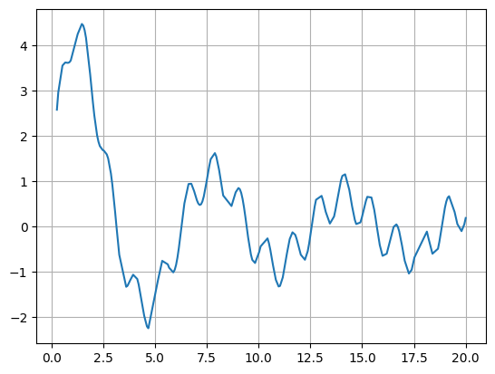
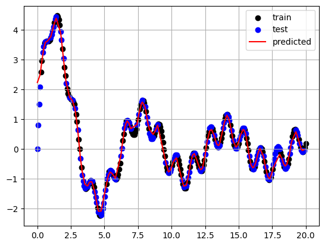

Getting Started
===============

Import the package specific classes and some helper packages for brevity.  

**matplotlib** for plotting.  
**jax.random** to set the key (this is not required but highly encouraged).    
**numpyro.distributions** to initialise our priors (just for clarity)    
**jax.numpy** to initialise our kernel parametes (just for clarity)    

.. code-block:: python

	from ife_surrogate.gp.models import WidebandGP
	from ife_surrogate.gp.kernels import Kriging
	from ife_surrogate.gp.trainers import SwarmTrainer

	import matplotlib.pyplot as plt
	import numpy as np
	import jax.random as jr
	import jax.numpy as jnp
	from numpyro.distributions import Uniform, LogUniform

Next we generate some dummy data:
(this is placeholder data until we find some data that better represents an actual usecase)

.. code-block:: python

	N = 300
	X = np.linspace(0, 20, N)[:, None]
	Y = np.sin(X) * 10 / (X + 1) + np.sin(X * 5) * 0.5

	ii = np.random.permutation(N)
	split = int(N * 0.5)
	i_train, i_test = ii[:split], ii[split:]
	i_train.sort()
	i_test.sort()

	x_train, y_train = X[i_train], Y[i_train]
	x_test, y_test = X[i_test], Y[i_test]

	plt.plot(x_train, y_train)
	plt.grid()

We suggest a 3-Step-Workflow:

1. **Kernel**

The Kernel defines the spatial link between the data.
To initialise the kernel requires defining the **priors** and the initial parameters. (This will likely be made easier in future versions.)
Here we use a Kriging Kernel, which uses a "lengthscale" and a "power" hyperparameter.

.. code-block:: python

	d = x_train.shape[1]
	priors = {"lengthscale" : Uniform(0, 1), "power" : LogUniform(0, 1)}
	kernel = Kriging(lengthscale=jnp.ones(d), power=jnp.ones(d), priors=priors)

2. **Model**

The Model holds the objective function, which is already implemented. It only needs the training data and the kernel.

.. code-block:: python

	model = WidebandGP(x_train, y_train, kernel)

3. **Trainer**

After instantiating the model we need to train it. 
We provide two trainers, OptaxTrainer and SwarmTrainer. Both have a variety of settings, which are explored in :doc:`trainer_guide` and in more detail in :doc:`/api/gp/trainers`. (tldr; OptaxTrainer is really fast, but sometimes fails to yield a result, Swarmtrainer is slower but always converges) 

.. code-block:: python

	trainer = SwarmTrainer()

	best_run, history = trainer.train(model)

Afterwards you can use the model to predict on new data:

.. code-block:: python

	predictions, variances = model.predict(x_test)

	plt.scatter(x_train, y_train, label="train", c="k")
	plt.scatter(x_test, y_test, label="test", c="b")
	plt.plot(x_test, predictions, label="predicted", c="r")
	plt.grid()
	plt.legend()
	plt.show()

